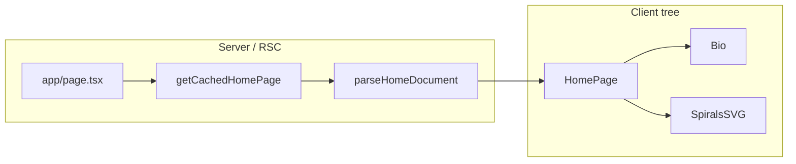

# Architecture

If you are new here, this page is your map. It explains how the site is structured, which technologies we rely on, and how a request goes from the App Router through Prismic data to UI.

## Tech stack

- **Framework**: Next.js 16 with the **App Router**. Routes live under `src/app/` (`page.tsx`, `layout.tsx`, Route Handlers under `src/app/api/`).
- **UI**: React 19, TypeScript.
- **CMS**: Prismic. Content types are generated into `src/prismic/types/prismic.generated.ts`; getters and parsers live in `src/prismic/`.
- **Data fetching**: Server Components and Prismic getters at request/build time with ISR (`revalidate`). No React Query in this repo.
- **Styling**: Global CSS ([src/styles/global.css](../../src/styles/global.css), [src/styles/critical.css](../../src/styles/critical.css)) plus **CSS Modules** (`.module.css`) for component-scoped rules.
- **Animation / graphics**: GSAP, custom SVG Spirals background (client-side), culori for color math.
- **Tooling**: pnpm, Biome for lint and format, Jest for unit tests.

## Directory map

### `src/app/`

Next.js App Router entrypoints.

- **`layout.tsx`** — Root layout: Space Mono font, global CSS, `SpiralsProvider`, Prismic preview toolbar, Google Analytics when configured, preview-mode overlay.
- **`page.tsx`** — Home route; fetches the Prismic home singleton and passes parsed data to `HomePage`.
- **`api/preview/route.ts`** / **`api/exit-preview/route.ts`** — Prismic draft/preview mode.
- **`slice-simulator/`** — Local Slice Machine preview (embedded iframe; relaxed CSP).
- **`robots.ts`**, **`manifest.ts`**, **`opengraph-image.png`** — SEO and PWA metadata.

### `src/components/`

One folder per feature component under `src/components/<ComponentName>/`. Layout and naming are described in [components.md](components.md).

Key pieces:

- **[HomePage.component.tsx](../../src/components/HomePage/HomePage.component.tsx)** — Client shell: Bio footer, Spirals controls, lazy-loaded SVG background.
- **[Bio.component.tsx](../../src/components/Bio/Bio.component.tsx)** — Renders Prismic Rich Text via `@prismicio/react`.
- **[Spirals/](../../src/components/Spirals/)** — Interactive generative background and playground UI.

### `src/prismic/`

- **Client**: [src/prismic/client.ts](../../src/prismic/client.ts) — singleton client with `enableAutoPreviews`.
- **Getters**: [getPage.ts](../../src/prismic/getPage.ts) — `getHomePage`, `getCachedHomePage`.
- **Parsers**: `parsePage.ts`, `parseImage.ts`, `parseSeoMeta.ts` normalize documents into app types.
- **Types**: `src/prismic/types/prismic.generated.ts` — generated; run `pnpm types:prismic`.
- **Constants**: [constants.ts](../../src/prismic/constants.ts) — revalidate seconds, document type IDs, config guards.

See [prismic.md](prismic.md).

### `src/contexts/`

- **[SpiralsContext.tsx](../../src/contexts/SpiralsContext.tsx)** — Reducer-driven state for spiral configs, playground open/close, and client readiness.

### `src/hooks/`

- **[usePreferredTheme.ts](../../src/hooks/usePreferredTheme.ts)** — Light/dark theme via `document.body.dataset.theme` and localStorage.
- **[useMediaQuery.ts](../../src/hooks/useMediaQuery.ts)** — `matchMedia` subscription for responsive UI (footer control tooltips at `72rem`).

### `src/helpers/` and `src/utils/`

Shared helpers split by topic. See [source-layout.md](source-layout.md).

### `src/styles/`

Global tokens, theme breakpoints ([theme.ts](../../src/styles/theme.ts)), icon SVGs under `src/styles/icons/`.

### `public/` and `scripts/`

Static assets and build helpers (e.g. [scripts/make_sitemap.js](../../scripts/make_sitemap.js) invoked from `make sitemap` / `pnpm build`).

## Data flow

1. **Route**: `src/app/page.tsx` (async Server Component) calls `getCachedHomePage()`.
2. **Fetch**: `getHomePage` uses the Prismic client (`getSingle` on the home custom type) when Prismic env is configured; returns `null` otherwise.
3. **Parse**: `parseHomeDocument` extracts hero Rich Text, SEO fields, and image metadata into `ParsedPage`.
4. **Render**: `HomePage` (client) composes Bio, Spirals controls, and the lazy SVG layer.
5. **Preview**: Draft mode + `enableAutoPreviews` serve unpublished content; overlay and toolbar indicate preview state.

## Config and deployment

- **[next.config.ts](../../next.config.ts)** — `env` exposure, images, Turbopack/SVG rules, security headers and CSP, cache headers, standalone output.
- **[biome.json](../../biome.json)** — lint and format; includes CSS. Run `pnpm lint`, `pnpm lint:fix`.
- **Branching**: Default branch is `staging`. Releases use `make release tag=vX.X.X`.

## Further reading

| Topic | Doc |
|-------|-----|
| CI, env vars, preview mode | [platform.md](platform.md) |
| GA | [integrations.md](integrations.md) |
| Sitemaps | [distribution.md](distribution.md) |
| Helpers, hooks, styles | [source-layout.md](source-layout.md) |
| Spirals | [spirals.md](spirals.md) |
| Theme | [patterns.md](patterns.md) |
