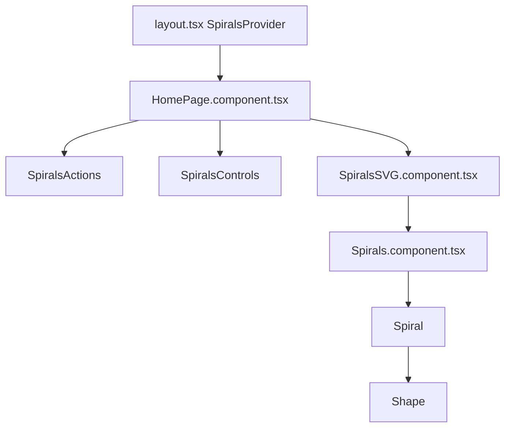

# Spirals

**Spirals** is the generative SVG background on the home page: layered, rotating armatures of shapes (circles, squares, triangles, polygons) with optional pulse animation, OKLCH color, and a client-side **playground** for live tweaking. It is the most complex interactive feature in this repo.

Read this chapter before changing geometry, animation, state, controls, or performance behavior.

## What the user sees

- A full-viewport fixed SVG behind the page content (`z-index: 0`).
- On first visit, a random set of 2–4 spiral **configs** is generated (see [Initialization](#initialization)).
- Footer actions (gamepad, refresh, download, theme) open the playground, randomize all sets, export the SVG, or toggle light/dark mode.
- The **Spiral Controls** slide-out panel exposes per-set sliders and color pickers.
- Each day the SVG remounts (`key={new Date().toDateString()}` in `HomePage`) so the background subtly changes over time.

## Component hierarchy



| File | Role |
|------|------|
| [SpiralsContext.tsx](../../src/contexts/SpiralsContext.tsx) | Reducer state: `configs[]`, playground open, client ready. |
| [HomePage.component.tsx](../../src/components/HomePage/HomePage.component.tsx) | Wires context → actions, controls, lazy SVG. |
| [SpiralsActions.component.tsx](../../src/components/Spirals/SpiralsActions.component.tsx) | Footer icon buttons (playground, randomize, download, theme). Hidden when panel is open. Labels use `<span>` tooltips positioned via [`useMediaQuery`](../../src/hooks/useMediaQuery.ts) at **`72rem`** (left on desktop, above on mobile)—same breakpoint as `.footer` row layout in [global.css](../../src/styles/global.css). |
| [SpiralsControls.component.tsx](../../src/components/Spirals/SpiralsControls.component.tsx) | Slide-out playground UI with sliders and color picker. |
| [SpiralsSVG.component.tsx](../../src/components/Spirals/SpiralsSVG.component.tsx) | Root `<svg class="fractal">`; batches config rendering. |
| [Spirals.component.tsx](../../src/components/Spirals/Spirals.component.tsx) | One `<g>` per config: rotation + scale via GSAP, N inner spirals. |
| `Spiral` (in Spirals.component.tsx) | One arm of shapes along a logarithmic-style spiral path. |
| `Shape` (in Spirals.component.tsx) | Single SVG primitive (`circle`, `rect`, `polygon`). |
| [Spirals.utils.ts](../../src/components/Spirals/Spirals.utils.ts) | Config types, random generation, OKLCH helpers, shape point math. |
| [SVG.component.tsx](../../src/components/SVG/SVG.component.tsx) | Fixed-position wrapper; opacity tied to `visible` prop. |

The CSS class **`fractal`** on the root SVG is the download target for `saveSvg(".fractal", …)`.

## Config model (`SpiralsConfig`)

Defined in [Spirals.utils.ts](../../src/components/Spirals/Spirals.utils.ts). Each config describes one layered spiral **set** (a `<g>` rotated as a unit).

| Field | Type | Purpose |
|-------|------|---------|
| `id` | `string` | UUID; React key and remove target. Regenerated on theme adjust. |
| `name` | `string?` | Display name in controls (auto-generated for random configs). |
| `animationSpeed` | `number` | Full rotation duration in **ms** (GSAP `duration = speed / 1000`). |
| `animationScale` | `number` | Target scale for the set (GSAP tween on change). |
| `pulseEnabled` | `boolean` | Per-shape scale pulse via GSAP. |
| `pulseSpeed` | `number` | Pulse cycle duration (seconds). |
| `pulseIntensity` | `number` | Max scale bump (e.g. `0.25` → scale `1.25`). |
| `pulseOffset` | `number` | Phase offset (radians) for staggered pulse. |
| `spiralCount` | `number` | Number of `Spiral` arms in this set (evenly spaced 360°). |
| `circleCount` | `number` | Shapes per arm (`count` in `Spiral`). |
| `circleOffset` | `number` | Base distance multiplier between shapes along an arm. |
| `elementSize` | `number` | Starting radius (`rad`) for shapes; grows by index. |
| `spiralSpacing` | `number` | Multiplier on distance (`0.25`–`1` in controls). |
| `fill` | `boolean` | Filled shapes vs outline-only. |
| `strokeWidth` | `number` | Stroke width when `fill` is false. |
| `opacitySubtraction` | `number` | Per-index opacity falloff along an arm. |
| `shape` | `"circle" \| "square" \| "triangle" \| "polygon"` | Primitive type. |
| `polygonSides` | `number` | Side count when `shape === "polygon"`. |
| `lightness`, `chroma`, `hue` | `number` | OKLCH color (rendered as `oklch(l c h / opacity)`). |

**Defaults** live in `DEFAULT_CONFIG` (used only until client init runs). **`generateRandomConfig()`** produces playground-ready configs with auto names like `"Cool Filled"`.

### Randomization rules

- **`generateRandomConfig`**: ~80% chance of pulse enabled; when pulse is on, caps `spiralCount` and `circleCount` lower to limit GSAP load.
- **`RANDOMIZE_ALL`** (reducer): Picks 2–4 new configs (fewer when pulse-heavy).
- **`INITIALIZE_RANDOM`** (on mount): Same count logic; replaces the default single config.

## Geometry

All coordinates use a **1500×1500** viewBox (`SPIRALS_CONSTANTS.VIEWBOX`). Center defaults to `(750, 750)`.

### Shape placement along one arm (`Spiral`)

For shape index `i` (0 … `count - 1`):

```
angle   = angleOffset * DEG_TO_RAD + i * (2π / count)
distance = offset * (i + 1) * spiralSpacing
x       = centerX + sin(angle) * distance
y       = centerY + cos(angle) * distance
radius  = rad + i
opacity = 1 - opacitySubtraction * i
```

Each **set** (`Spirals`) renders `spiralCount` arms with `angleOffset = (360 / spiralCount) * i` degrees.

### Shape primitives (`Shape`)

| Shape | SVG element | Notes |
|-------|-------------|-------|
| `circle` | `<circle>` | Default. |
| `square` | `<rect>` | Side length `radius * 2`, centered on `(x, y)`. |
| `triangle` | `<polygon>` | Equilateral; points from `getTrianglePoints`. |
| `polygon` | `<polygon>` | Regular N-gon via `getPolygonPoints`; cached in `shapeCache`. |

Polygon/triangle point strings are **memoized** by `(shape, cx, cy, radius, sides)` to avoid recomputation during GSAP attr tweens.

## Animation (GSAP)

All animation runs client-side in [Spirals.component.tsx](../../src/components/Spirals/Spirals.component.tsx).

### Set-level (`Spirals`)

| Animation | Trigger | Behavior |
|-----------|---------|----------|
| **Rotation** | `config.animationSpeed` | Infinite 360° rotation around viewBox center. Direction (`±1`) chosen once per mount via `randomDirectionRef`. |
| **Scale** | `config.animationScale` | Single tween to target scale (`back.out(1.7)`, 0.8s). |

Both use `svgOrigin` at viewBox center. Previous tweens are **`kill()`ed** before starting new ones; cleanup on unmount.

### Arm-level (`Spiral`)

| Animation | Trigger | Behavior |
|-----------|---------|----------|
| **Layout tween** | `count`, `offset`, `spiralSpacing`, `angleOffset`, `rad` change | GSAP `attr` tween (0.6s) moves/resizes shapes to new positions. |
| **Pulse** | `pulseEnabled` + pulse params | Subset of shapes (max ~10 active) get repeating scale yoyo. Interval `floor(count / maxPulsingShapes)`. Stagger via `pulseOffset` and index. |

When pulse is disabled, all pulse tweens are killed. In development, pulse count is logged: `🎯 Pulse Performance: N active animations for M shapes`.

## State management

[SpiralsContext.tsx](../../src/contexts/SpiralsContext.tsx) uses `useReducer`.

### State

```ts
interface SpiralsState {
  configs: SpiralsConfig[];
  isPlaygroundOpen: boolean;
  clientReady: boolean;
}
```

### Actions

| Action | Effect |
|--------|--------|
| `UPDATE_CONFIG` | Replace config at index (slider/color change). |
| `ADD_SPIRAL_SET` | Prepend `generateRandomConfig()`. |
| `REMOVE_SPIRAL_SET` | Remove by `id`; no-op if only one set remains. |
| `RANDOMIZE_ALL` | Replace all configs with 2–4 random sets. |
| `TOGGLE_PLAYGROUND` | Flip `isPlaygroundOpen`. |
| `SET_CLIENT_READY` | Set when footer enters viewport (gates SVG mount). |
| `INITIALIZE_RANDOM` | On mount: replace defaults with random configs. |
| `ADJUST_FOR_THEME` | Re-map configs with `adjustConfigsForTheme` (new IDs, adjusted lightness). |

### Initialization

1. Server render: `initialState` has `[DEFAULT_CONFIG]`, `clientReady: false`.
2. Client mount: `INITIALIZE_RANDOM` replaces configs with random sets.
3. When `configs.length` changes: `ADJUST_FOR_THEME` runs once to tune lightness for light/dark mode.

Access via **`useSpirals()`** — throws if used outside `SpiralsProvider` (mounted in [layout.tsx](../../src/app/layout.tsx)).

## HomePage integration

[HomePage.component.tsx](../../src/components/HomePage/HomePage.component.tsx) orchestrates loading and UI:

1. **`useInView`** on `PageContainer` — when the footer region is visible, dispatches `SET_CLIENT_READY`.
2. **`SpiralsControls`** — always mounted (panel can slide open).
3. **`SpiralsSVG`** — only when `clientReady`; lazy-loaded + `Suspense` fallback.
4. **`key={new Date().toDateString()}`** — forces daily remount of the SVG subtree.

Action handlers are memoized with `useMemo` to avoid re-rendering children on unrelated state changes.

## Performance

| Technique | Where | Why |
|-----------|-------|-----|
| Lazy import | `HomePage` → `SpiralsSVG` | Defers GSAP + heavy SVG tree from initial bundle. |
| Intersection gate | `useInView` + `clientReady` | No SVG work until user scrolls near content. |
| Batch rendering | `SpiralsSVG` | Loads configs in batches of 3, 100ms apart. |
| `memo` | `Shape`, `Spiral`, `Spirals` | Limits re-renders when sibling configs change. |
| Shape/point cache | `Spirals.utils` | Avoids recomputing polygon paths. |
| OKLCH cache | `hexToOklch` / `oklchToHex` | Color picker throttling (50ms) + cached conversions. |
| Pulse cap | `Spiral` | At most ~10 concurrent pulse tweens per arm regardless of shape count. |
| Random caps | `generateRandomConfig` | Lower spiral/circle counts when pulse enabled. |

Package import optimization for `gsap` and `culori` is enabled in [next.config.ts](../../next.config.ts).

## Theme

Colors are stored and rendered in **OKLCH** for perceptually smooth gradients and picker round-trips.

- **`adjustLightnessForTheme(lightness)`** — In light mode, scales lightness down (`× 0.6`, clamped 0.2–0.6). Checks `document.body.dataset.theme`, `theme-light`/`theme-dark` classes, and `prefers-color-scheme`.
- **`adjustConfigsForTheme(configs)`** — Maps all configs with adjusted lightness and **new UUIDs** (forces React remount of affected sets).

Theme preference UI lives in [usePreferredTheme.ts](../../src/hooks/usePreferredTheme.ts) (`data-theme` on `body`). The toggle button is in **SpiralsActions** (moon/sun icon)—not the header. Spirals does not subscribe to the hook directly—it reacts via `ADJUST_FOR_THEME` when config count changes and via live reads in `adjustLightnessForTheme` during random generation.

## Playground UI

[SpiralsControls.component.tsx](../../src/components/Spirals/SpiralsControls.component.tsx):

- Slide-out panel (`role="dialog"`, Escape to close, backdrop click to close).
- Per-set fieldset with sliders for speed, scale, shape count, spacing, size, style, shape, polygon sides, stroke, color.
- Color input converts hex ↔ OKLCH with **50ms throttle** per set index.
- `--spiral-color` CSS variable on each set card matches the config hue.
- Styles use tokens from [variables.css](../../src/styles/variables.css) (`--spirals-*`).

Controls not exposed in the UI but present on config: `pulseEnabled`, `pulseSpeed`, `pulseIntensity`, `pulseOffset`, `spiralCount`, `opacitySubtraction`. Tweak those in `generateRandomConfig` or add sliders if you need user control.

## Download / export

**`saveSvg(".fractal", filename)`** in [src/utils/helpers.ts](../../src/utils/helpers.ts):

1. Queries the DOM for `.fractal` (the root SVG).
2. Sets `xmlns`, serializes `outerHTML`, triggers a Blob download.

Filename from **`generateSpiralFileName(configs)`**: `spirals-{names}-{ISO-timestamp}.svg`.

Download is available from footer actions and from the controls panel (mobile + desktop buttons).

## Styling the canvas

[SVG.module.css](../../src/components/SVG/SVG.module.css):

- Fixed position, full viewport height (`100dvh`; extra top offset on mobile).
- Opacity `0.85` when visible (desktop); fade-in transition over 1s.
- Background fill on the SVG element: `var(--color-bg)`.

Spirals sit **behind** page content; footer and bio remain interactive above.

## Extending Spirals

### Add a new shape type

1. Extend `SpiralsConfig.shape` union and `generateRandomConfig` shapes array.
2. Add case in `Shape` switch and GSAP `attr` branch in `Spiral` layout effect.
3. Add point helper (with caching) in `Spirals.utils.ts` if non-primitive.
4. Add `<option>` in `SpiralsControls` shape select.

### Add a config field

1. Add to `SpiralsConfig`, `DEFAULT_CONFIG`, and `generateRandomConfig`.
2. Pass through `Spirals` → `Spiral` → `Shape` as needed.
3. Add control in `SpiralsControls` (or set in random generator only).
4. Include in `Spirals` / `Spiral` `useMemo` dependency arrays.

### Change defaults on first paint

Edit `INITIALIZE_RANDOM` / `generateRandomConfig` in [SpiralsContext.tsx](../../src/contexts/SpiralsContext.tsx) and [Spirals.utils.ts](../../src/components/Spirals/Spirals.utils.ts)—not `DEFAULT_CONFIG` alone (client init overwrites it immediately).

### Debugging tips

- Pulse load: watch dev console for `🎯 Pulse Performance` logs.
- Config state: React DevTools → `SpiralsProvider` → `state.configs`.
- SVG not showing: check `clientReady`, `visible` prop, and `SVG.module.css` `.visible` rules.
- Janky slider updates: color picker is throttled; other sliders dispatch on every input event (expected).

## Related docs

| Topic | Doc |
|-------|-----|
| Component file layout | [components.md](components.md) |
| Theme hook | [patterns.md](patterns.md#theme-preference) |
| `src/utils/helpers` (`saveSvg`) | [source-layout.md](source-layout.md) |
| Global CSS variables | [source-layout.md](source-layout.md) |
