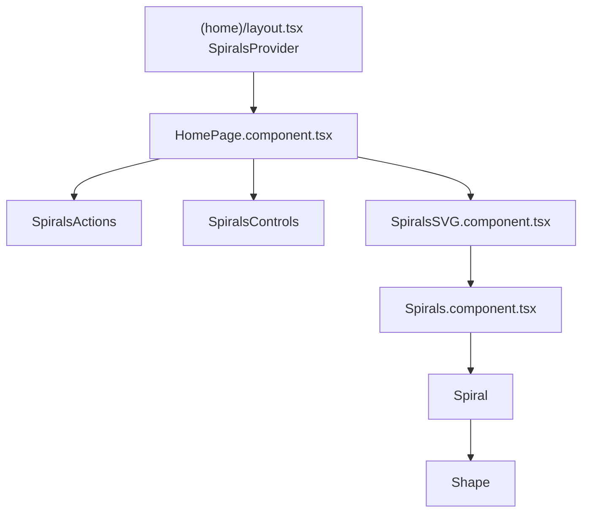

# Spirals

**Spirals** is the generative SVG background on the home page: layered, rotating armatures of shapes (circles, squares, triangles, polygons) with optional pulse animation, OKLCH color, and a client-side **playground** for live tweaking. It is the most complex interactive feature in this repo.

Read this chapter before changing geometry, animation, state, controls, or performance behavior. For a prioritized refactor/perf backlog, see [spirals-modernization.md](spirals-modernization.md).

## What the user sees

- A full-viewport fixed SVG behind the page content (`z-index: 0`).
- On first visit, a random set of **3–4** spiral **configs** is generated (see [Initialization](#initialization)).
- Footer actions (gamepad, refresh, download, theme) open the playground, randomize all sets, export the SVG, or toggle light/dark mode.
- The **Spiral Controls** slide-out panel exposes per-set sliders and color pickers.
- Each day the SVG remounts (`key={new Date().toDateString()}` in `HomePage`) so the background subtly changes over time.

## Component hierarchy


```mermaid
flowchart TB
  Layout["(home)/layout.tsx SpiralsProvider"]
  HP[HomePage.component.tsx]
  SA[SpiralsActions]
  SC[SpiralsControls]
  SVG[SpiralsSVG.component.tsx]
  S[Spirals.component.tsx]
  Sp[Spiral]
  Sh[Shape]

  Layout --> HP
  HP --> SA
  HP --> SC
  HP --> SVG
  SVG --> S
  S --> Sp
  Sp --> Sh
```

| File | Role |
|------|------|
| [SpiralsContext.tsx](../../src/contexts/SpiralsContext.tsx) | Reducer + split contexts (`useSpiralsDispatch`, `useSpiralsState`, `useSpiralsConfigs`). |
| [HomePage.component.tsx](../../src/components/HomePage/HomePage.component.tsx) | Wires context → actions, controls, [`HomePageSpiralsLayer`](../../src/components/HomePage/HomePageSpiralsLayer.component.tsx). |
| [HomePageSpiralsLayer.component.tsx](../../src/components/HomePage/HomePageSpiralsLayer.component.tsx) | Memoized mount gate for `SpiralsSVG` (`initialized` + `useInView`). |
| [SpiralsActions.component.tsx](../../src/components/Spirals/SpiralsActions.component.tsx) | Footer icon buttons (playground, randomize, download, theme). Unmounts with **`ViewTransition`** when the panel opens (toggle wrapped in **`startTransition`**). Labels use `<span>` tooltips positioned via [`useMediaQuery`](../../src/hooks/useMediaQuery.ts) at **`72rem`** (left on desktop, above on mobile)—same breakpoint as `.footer` row layout in [global.css](../../src/styles/global.css). |
| [SpiralsControls.component.tsx](../../src/components/Spirals/SpiralsControls.component.tsx) | Slide-out playground UI with sliders and color picker. |
| [SpiralsSVG.component.tsx](../../src/components/Spirals/SpiralsSVG.component.tsx) | Root `<svg class="fractal">`; always mounts paint-ordered sets; **`SVG`** toggles opacity via **`visible`** (no unmount when off-screen). Paint order via **`sortConfigsForPaintOrder`** (largest **`animationScale`** / reach drawn first so smaller sets stay on top). |
| [Spirals.component.tsx](../../src/components/Spirals/Spirals.component.tsx) | One `<g>` per config: rotation + scale via `gsap.context`. |
| [Spiral.component.tsx](../../src/components/Spirals/Spiral.component.tsx) | One arm of shapes; layout + pulse tweens in `gsap.context`. |
| [Shape.component.tsx](../../src/components/Spirals/Shape.component.tsx) | Single SVG primitive; registers DOM node for GSAP via stable callback. |
| [Spirals.utils.ts](../../src/components/Spirals/Spirals.utils.ts) | Config types, random generation, OKLCH helpers, shape point math. |
| [SVG.component.tsx](../../src/components/SVG/SVG.component.tsx) | Fixed-position wrapper; opacity tied to `visible` prop. |

The CSS class **`fractal`** on the root SVG is the download target for `saveSvg(".fractal", …)`.

## Config model (`SpiralsConfig`)

Defined in [Spirals.utils.ts](../../src/components/Spirals/Spirals.utils.ts). Each config describes one layered spiral **set** (a `<g>` rotated as a unit).

| Field | Type | Purpose |
|-------|------|---------|
| `id` | `string` | UUID; React key and remove target. Stable across theme tweaks. |
| `name` | `string?` | Display name in controls (auto-generated for random configs). |
| `animationSpeed` | `number` | Full rotation duration in **ms** (GSAP `duration = speed / 1000`). |
| `animationScale` | `number` | Target scale for the set (GSAP tween on change). |
| `pulseEnabled` | `boolean` | Per-shape scale pulse via GSAP. |
| `pulseSpeed` | `number` | Pulse cycle duration (seconds). |
| `pulseIntensity` | `number` | Max scale bump (e.g. `0.25` → scale `1.25`). |
| `pulseOffset` | `number` | Phase offset (radians) for staggered pulse. |
| `shapeSpinEnabled` | `boolean` | Per-shape rotation on each arm (independent of set rotation). |
| `shapeSpinSpeed` | `number` | Seconds per full shape rotation. |
| `shapeSpinDirection` | `1 \| -1` | Default spin direction for even-index shapes. |
| `shapeSpinAlternate` | `boolean` | When true, odd-index shapes spin the opposite way. |
| `spiralCount` | `number` | Number of `Spiral` arms in this set (evenly spaced 360°). |
| `circleCount` | `number` | Shapes per arm (`count` in `Spiral`). |
| `circleOffset` | `number` | Base distance multiplier between shapes along an arm. |
| `elementSize` | `number` | Starting radius (`rad`) for shapes; grows by index. |
| `spiralSpacing` | `number` | Multiplier on distance (`0.25`–`1` in controls). |
| `fill` | `boolean` | Filled shapes vs outline-only. |
| `strokeWidth` | `number` | Stroke width when `fill` is false. |
| `opacitySubtraction` | `number` | Per-index opacity falloff along an arm. |
| `shape` | `"circle" \| "square" \| "triangle" \| "polygon"` | Primitive type. |
| `polygonSides` | `number` | Side count when `shape === "polygon"`. |
| `lightness`, `chroma`, `hue` | `number` | OKLCH color (rendered as `oklch(l c h / opacity)`). |

**Defaults** live in `DEFAULT_CONFIG` (used only until client init runs). **`generateRandomConfig()`** produces playground-ready configs with auto names like `"Cool Filled"`.

### Randomization rules

Harmonic generation lives in **`createRandomConfigSet()`** and **`generateRandomConfig()`** ([Spirals.utils.ts](../../src/components/Spirals/Spirals.utils.ts)):

1. **Composition-first** — One shared plan per set: symmetry tier (sparse / balanced / dense), **scale mood** (hero **`elementSize`** up to **40** intimate / **65** classic / **78** monumental; roll **40% / 35% / 25%**), shape family (`mixed` | `orb` | `hex` | `angular` — **`mixed` is common**; each layer can still roll a one-off shape via **`pickRandomShapeVariant`**), base OKLCH hue + chroma, the same **`spiralCount`** on every layer (3, 4, 6, 8, or 12), and **one hero anchor** for **`animationScale`**, **`elementSize`**, and **`circleOffset`**. Support layers step down via φ-ish scale factors plus mood-sized steps so each layer stays visibly smaller than the one behind it (quality gate penalizes flat or inverted scale stacks).
2. **Sacred-ish numbers** — **`circleCount`** from Fibonacci options (5, 8, 13, 21); **`spiralSpacing`** from 0.5, 0.618, or 0.75; layer speeds scale by 3:2 or φ; hues step analogously (~32°) or by the golden angle (~137.5°).
3. **Quality gate** — Up to five resamples until **`harmonicConfigSetPassesQualityGate`** passes (shape budget, at most one pulse layer, hue/chroma spread, harmonic counts, and **`estimateSpiralReach` ≥ `MIN_HERO_SPIRAL_REACH`** so the primary layer never collapses to a tiny center blob).

- **`generateRandomConfig(existing?)`** — Single layer from a fresh composition, or a new layer matched to **`existing`** configs (add-spiral-set).
- **`RANDOMIZE_ALL`** / **`INITIALIZE_RANDOM`** — Replace configs via **`createRandomConfigSet()`** (**3–4** layers; at least **`HARMONIC_MINIMUMS.minSpiralSetCount`**). Color modes include **triadic** and **split** palettes with per-layer chroma/lightness variation; quality gate rejects sets whose hues are too close.

## Geometry

All coordinates use a **1500×1500** viewBox (`SPIRALS_CONSTANTS.VIEWBOX`). Center defaults to `(750, 750)`.

### Shape placement along one arm (`Spiral`)

For shape index `i` (0 … `count - 1`):

```
angle   = angleOffset * DEG_TO_RAD + i * (2π / count)
distance = offset * (i + 1.35) * spiralSpacing
x       = centerX + sin(angle) * distance
y       = centerY + cos(angle) * distance
radius  = rad + i
opacity = 1 - opacitySubtraction * i
```

Each **set** (`Spirals`) renders `spiralCount` arms with `angleOffset = (360 / spiralCount) * i` degrees.

### Shape primitives (`Shape`)

| Shape | SVG element | Notes |
|-------|-------------|-------|
| `circle` | `<circle>` | Default. |
| `square` | `<rect>` | Side length `radius * 2`, centered on `(x, y)`. |
| `triangle` | `<polygon>` | Equilateral; points from `getTrianglePoints`. |
| `polygon` | `<polygon>` | Regular N-gon via `getPolygonPoints`; cached in `shapeCache`. |

Polygon/triangle point strings are **memoized** by `(shape, cx, cy, radius, sides)` to avoid recomputation during GSAP attr tweens.

## Animation (GSAP)

Set-level animation runs in [Spirals.component.tsx](../../src/components/Spirals/Spirals.component.tsx); per-arm layout, pulse, and shape spin run in [Spiral.component.tsx](../../src/components/Spirals/Spiral.component.tsx).

### Set-level (`Spirals`)

| Animation | Trigger | Behavior |
|-----------|---------|----------|
| **Rotation** | `config.animationSpeed` | Infinite 360° rotation around viewBox center. Direction (`±1`) chosen once per mount via `randomDirectionRef`. |
| **Scale** | `config.animationScale` | Single tween to target scale (`back.out(1.7)`, 0.8s). |

Both use `svgOrigin` at viewBox center inside a **`gsap.context`**; **`revert()`** on cleanup.

### Arm-level (`Spiral`)

| Animation | Trigger | Behavior |
|-----------|---------|----------|
| **Layout tween** | `count`, `offset`, `spiralSpacing`, `angleOffset`, `rad` change | GSAP `attr` tween (0.6s) moves/resizes shapes to new positions. |
| **Pulse** | `pulseEnabled` + pulse params | Subset of shapes (max ~10 active) get repeating scale yoyo. Interval `floor(count / maxPulsingShapes)`. Stagger via `pulseOffset` and index. |
| **Shape spin** | `shapeSpinEnabled` + spin params | Subset of shapes (max ~12 active per arm, same stride pattern as pulse) rotate in place via **`svgOrigin`** at each shape’s `(x, y)`. Optional **`shapeSpinAlternate`** flips direction on odd indices. |

Layout, pulse, and spin share one **`gsap.context`** per arm; **`revert()`** on dependency change tears down all tweens for that arm.

## State management

[SpiralsContext.tsx](../../src/contexts/SpiralsContext.tsx) uses `useReducer`.

### State

```ts
interface SpiralsState {
  configs: SpiralsConfig[];
  isPlaygroundOpen: boolean;
  initialized: boolean;
}
```

### Actions

| Action | Effect |
|--------|--------|
| `UPDATE_CONFIG` | Replace config at index (slider/color change). |
| `ADD_SPIRAL_SET` | Prepend `generateRandomConfig()`. |
| `REMOVE_SPIRAL_SET` | Remove by `id`; no-op when **`configs.length` ≤ `minSpiralSetCount` (3)**. |
| `RANDOMIZE_ALL` | Replace all configs with 3–4 random sets (minimum three). |
| `TOGGLE_PLAYGROUND` | Flip `isPlaygroundOpen`. |
| `INITIALIZE_RANDOM` | On mount: replace defaults with `createRandomConfigSet()` and set `initialized: true`. |

### Initialization

1. Server render: `initialState` has `[DEFAULT_CONFIG]`, `initialized: false`.
2. Client mount (once): `INITIALIZE_RANDOM` replaces configs with random sets and sets `initialized: true`.
3. **`HomePageSpiralsLayer`** mounts `SpiralsSVG` only when **`initialized`** so GSAP does not run on the placeholder default config.

Access via **`useSpiralsDispatch()`**, **`useSpiralsState()`**, **`useSpiralsConfigs()`**, or combined **`useSpirals()`** — throws if used outside `SpiralsProvider` (home layout wraps **`SpiralsProvider`** for `/` only).

## HomePage integration

[HomePage.component.tsx](../../src/components/HomePage/HomePage.component.tsx) orchestrates loading and UI:

1. **`useInView`** on `PageContainer` — drives `SpiralsSVG` `visible` (SVG opacity when off-screen; sets stay mounted).
2. **`SpiralsControls`** — always mounted; the slide-out panel is wrapped in React 19 **`Activity`** (`mode="hidden"` when closed) so slider/color state is kept but panel Effects (e.g. color-picker throttles) are torn down while closed. Range sliders use **50ms** throttle like the color picker.
3. **`HomePageSpiralsLayer`** — memoized; mounts `SpiralsSVG` when `initialized`, inside `Suspense` + [`SpiralsBrowserGate`](SpiralsBrowserGate.component.tsx) (`use(browser())`).
4. **`key={new Date().toDateString()}`** — forces daily remount of the SVG subtree.
5. **Playground toggle** — `startTransition` + **`ViewTransition`** on footer **`SpiralsActions`** for enter/exit when the panel opens or closes.

Action handlers are memoized with `useMemo` to avoid re-rendering children on unrelated state changes.

## Performance

| Technique | Where | Why |
|-----------|-------|-----|
| Conditional mount | `HomePageSpiralsLayer` | No SVG/GSAP until `initialized` (static import avoids Turbopack lazy-chunk issues with React Compiler). |
| Memoized layer | `HomePageSpiralsLayer` | Playground toggles skip re-rendering the SVG subtree when `configs` / `inView` / `initialized` are unchanged. |
| `Activity` | `SpiralsControls` panel only | Keep slider state while hidden; tear down panel effects when closed. |
| `gsap.context` | `Spirals` + `Spiral` | Set rotation/scale; one context per arm for layout + pulse + spin; `revert()` on cleanup. |
| `ViewTransition` + `startTransition` | `SpiralsActions`, playground toggle | Footer actions animate on playground open/close. |
| Intersection gate | `useInView` → `SpiralsSVG.visible` | Off-screen: SVG opacity only; sets stay mounted (no GSAP teardown from unmount). |
| LRU caches | `Spirals.utils` + [lruMap.ts](../../src/helpers/lruMap.ts) | Cap shape + OKLCH maps; **`getLruMapEntry`** refreshes order on read. |
| Shape/point cache | `Spirals.utils` | Avoids recomputing polygon paths. |
| OKLCH cache | `hexToOklch` / `oklchToHex` | Color picker throttling (50ms) + cached conversions. |
| Pulse / spin caps | `Spiral` | At most ~10 pulse and ~12 spin tweens per arm (stride sampling when `circleCount` is large). |
| Harmonic random + gate | `createRandomConfigSet` | Composition-first sets; resample if quality score is low. |

Package import optimization for `gsap` and `culori` is enabled in [next.config.ts](../../next.config.ts).

## Theme

Colors are stored and rendered in **OKLCH** for perceptually smooth gradients and picker round-trips.

- Config **`lightness`** is stored as theme-neutral OKLCH L (random generation does not bake in light mode).
- **`resolveLightnessForTheme(lightness, theme?)`** — At render, scales lightness down in light mode (`× 0.6`, clamped 0.2–0.6). **`theme`** is **`SpiralsThemePreference`** (`"dark" | "light" | "no-preference"`) from **`usePreferredTheme`**. Used by **`Spirals`** and **SpiralsControls** (swatch + picker display).
- **`storeLightnessFromPicker(pickerL, theme?)`** — Inverse when saving color-picker edits in light mode so stored base stays stable.

Theme preference UI lives in [usePreferredTheme.ts](../../src/hooks/usePreferredTheme.ts) (`data-theme` on `body`). The toggle button is in **SpiralsActions** (moon/sun icon)—not the header. Toggling theme re-renders spiral consumers through the theme store; config ids and stored lightness are unchanged.

## Playground UI

[SpiralsControls.component.tsx](../../src/components/Spirals/SpiralsControls.component.tsx):

- Slide-out panel (`role="dialog"`, Escape to close, backdrop click to close).
- Per-set fieldset with sliders for speed, scale, shape count, spacing, size, style, shape, polygon sides, stroke, color.
- Color input converts hex ↔ OKLCH with **50ms throttle** per set index.
- `--spiral-color` CSS variable on each set card matches the config hue.
- Styles use tokens from [variables.css](../../src/styles/variables.css) (`--spirals-*`).

Controls not exposed in the UI but present on config: `pulseEnabled`, `pulseSpeed`, `pulseIntensity`, `pulseOffset`, `spiralCount`, `opacitySubtraction`. Tweak those in `generateRandomConfig` or add sliders if you need user control.

## Download / export

**`saveSvg(".fractal", filename)`** in [src/utils/helpers.ts](../../src/utils/helpers.ts):

1. Queries the DOM for `.fractal` (the root SVG).
2. Sets `xmlns`, serializes `outerHTML`, triggers a Blob download.

Filename from **`generateSpiralFileName(configs)`**: `spirals-{names}-{ISO-timestamp}.svg`.

Download is available from footer actions and from the controls panel (mobile + desktop buttons).

## Styling the canvas

[SVG.module.css](../../src/components/SVG/SVG.module.css):

- Fixed position, full viewport height (`100dvh`; extra top offset on mobile).
- Opacity `0.85` when visible (desktop); fade-in transition over 1s.
- Background fill on the SVG element: `var(--color-bg)`.

Spirals sit **behind** page content; footer and bio remain interactive above.

## Extending Spirals

### Add a new shape type

1. Extend `SpiralsConfig.shape` union and `generateRandomConfig` shapes array.
2. Add case in `Shape` switch and GSAP `attr` branch in `Spiral` layout effect.
3. Add point helper (with caching) in `Spirals.utils.ts` if non-primitive.
4. Add `<option>` in `SpiralsControls` shape select.

### Add a config field

1. Add to `SpiralsConfig`, `DEFAULT_CONFIG`, and `generateRandomConfig`.
2. Pass through `Spirals` → `Spiral` → `Shape` as needed.
3. Add control in `SpiralsControls` (or set in random generator only).
4. Include in `Spirals` / `Spiral` `useMemo` dependency arrays.

### Change defaults on first paint

Edit `INITIALIZE_RANDOM` / `generateRandomConfig` in [SpiralsContext.tsx](../../src/contexts/SpiralsContext.tsx) and [Spirals.utils.ts](../../src/components/Spirals/Spirals.utils.ts)—not `DEFAULT_CONFIG` alone (client init overwrites it immediately).

### Debugging tips

- Pulse load: at most ~10 concurrent pulse tweens per arm (`Spiral` caps by `count`).
- Config state: React DevTools → `SpiralsProvider` → `state.configs`.
- SVG not showing: check `initialized`, `visible` prop, and `SVG.module.css` `.visible` rules.
- Janky slider updates: color picker is throttled; other sliders dispatch on every input event (expected).

## Related docs

| Topic | Doc |
|-------|-----|
| Component file layout | [components.md](components.md) |
| Theme hook | [patterns.md](patterns.md#theme-preference) |
| `src/utils/helpers` (`saveSvg`) | [source-layout.md](source-layout.md) |
| Global CSS variables | [source-layout.md](source-layout.md) |
